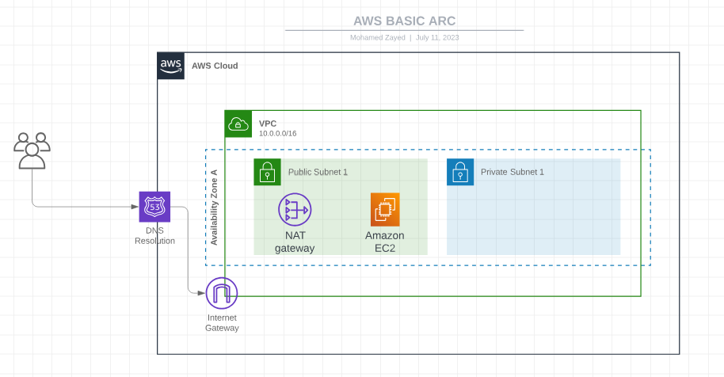

# Intro
Highly available architecture on AWS using Terraform, For learning purposes

# Architecture

# Requirements
- terraform latest version
- AWS account
- Make sure you have `AWS_ACCESS_KEY` and `AWS_SECRET_KEY` in your env vars
- `export AWS_ACCESS_KEY=xxxx`
- `export AWS_SECRET_KEY=xxxx`

# Run
- `terraform apply -auto-approve`
